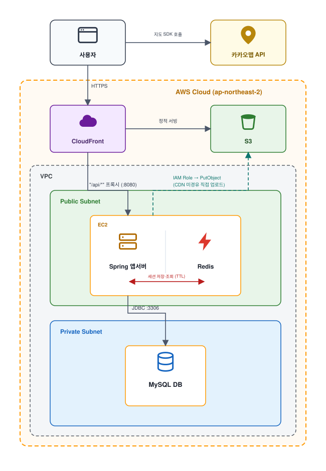
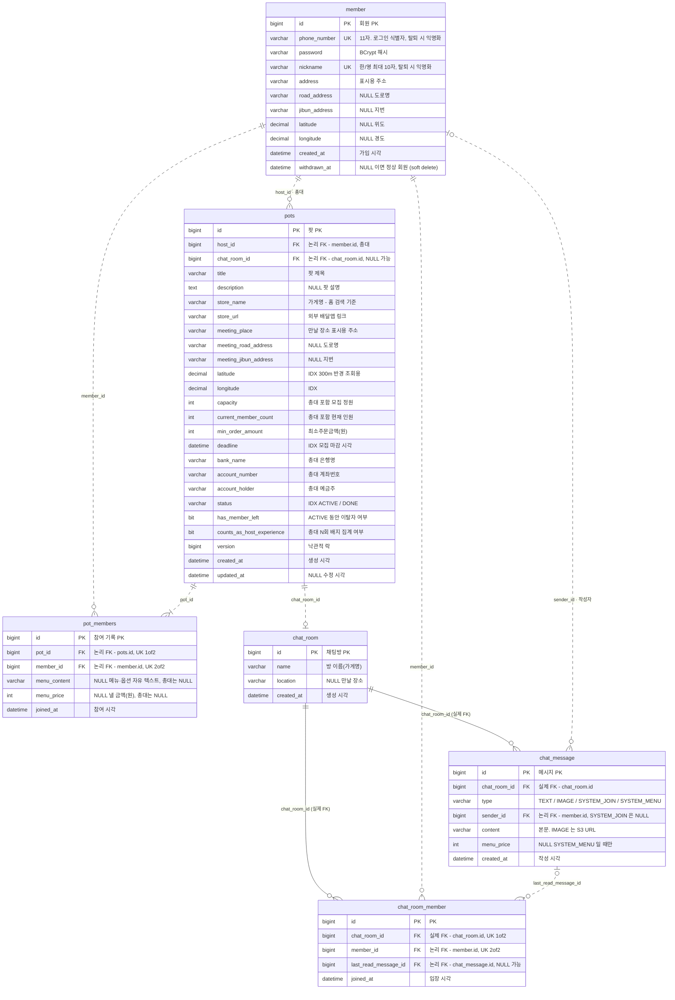
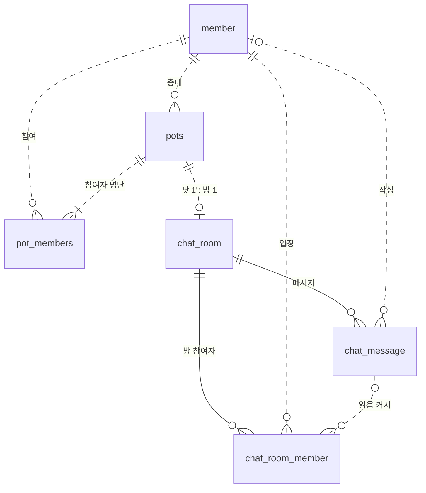

## 프로젝트 선택 주제
근거리 기반 나눔 / 교환 / 직거래 플랫폼  
> ⚠️ **주제 지침:** 1~2인 가구의 공동구매 조율/결제/정산 번거로움 문제에 집중할 것

---

## 서비스 설명

> 💡 **근처에 있는 사람과 함께 배달하고 싶은 1인 주문자를 위한 위치 기반 배달 모임 플랫폼**

**델리팟(Delipot)** 은 혼자 배달을 시키기엔 배달비가 부담스럽고 최소주문금액을 채우기 어려운 1인 주문자를 위한 위치 기반 공동 배달 플랫폼입니다. 

* **참여 및 개설:** 반경 300m 안의 근처 유저가 연 배달팟(공동 배달 모임)에 원하는 메뉴를 입력해 참여하거나 직접 배달팟을 만들 수 있습니다.
* **소통 및 정산:** 배달팟이 생성되면 공동 주문에 필요한 정보가 정리된 채팅방이 만들어지고, 유저는 채팅방에서 주문 진행 상황을 공유할 수 있습니다.

 

## 🛠️ Tech Stack

| 분류 | 기술 스택 |
| --- | --- |
| 프론트엔드 |     
| 백엔드 |        |
| 인프라 |       |
| 협업 |     |

 

## 🏗️ 인프라 아키텍처

 

# Delipot 스키마 ERD

`backend/src/main/java/com/delipot` 의 엔티티 6개를 옮긴 DDL 스냅샷.
MySQL 8.4 / InnoDB / utf8mb4, 스키마는 `ddl-auto: update` 로 생성된다.

| | |
|---|---|
| 테이블 | 6 |
| 관계 | 9 |
| 실제 FK 제약 | 2 (둘 다 `chat_room` 을 향한다) |
| 논리적 FK | 7 (plain 컬럼, 앱이 정합성 보장) |

---

## 관계도

> 실선(`--`)은 DB 에 실제로 걸린 외래키, 점선(`..`)은 컬럼만 있고 제약이 없는 논리적 관계다.
> 엔티티 박스의 `FK` 배지도 같은 구분을 코멘트에 적어뒀다.

### 관계만 보는 축약본

---

## 까마귀발 표기 읽는 법

| 기호 | 뜻 | mermaid |
|---|---|---|
| `┃` (바) | 정확히 1 — 필수, 단일 | `\|\|` |
| `○┃` (원+바) | 0 또는 1 — nullable 참조 | `\|o` / `o\|` |
| `○<` (원+까마귀발) | 0 이상 N — 없을 수도 있음 | `}o` / `o{` |
| `┃<` (바+까마귀발) | 1 이상 N — 최소 한 행 보장 | `}\|` / `\|{` |
| 실선 | 실제 FK 제약 (DB 가 보장) | `--` |
| 점선 | 논리적 관계 (앱이 보장) | `..` |

---

## 관계 9개

| 관계 | 카디널리티 | 연결 컬럼 | 제약 | 읽는 법 |
|---|---|---|---|---|
| member → pots | 1 : 0..N | `pots.host_id` | 논리 | 회원 한 명이 팟을 여러 개 연다. 팟에는 총대가 반드시 한 명. |
| member → pot_members | 1 : 0..N | `pot_members.member_id` | 논리 | 회원은 여러 팟에 참여. 같은 팟엔 `UNIQUE(pot_id, member_id)` 로 한 번만. |
| pots → pot_members | 1 : 1..N | `pot_members.pot_id` | 논리 | 총대도 참여 기록 1행으로 들어가므로 최소 한 행. |
| pots → chat_room | 1 : 0..1 | `pots.chat_room_id` | 논리 | 팟 하나에 방 하나. 저장 직후 1회만 세팅, 팟이 `DONE` 이어도 방은 남는다. |
| chat_room → chat_room_member | 1 : 0..N | `chat_room_member.chat_room_id` | **실제 FK** | 방 참여자 목록. `@ManyToOne` 이라 DB 제약이 걸린다. |
| member → chat_room_member | 1 : 0..N | `chat_room_member.member_id` | 논리 | 한 회원이 여러 방에. 방 안에선 `UNIQUE(chat_room_id, member_id)`. |
| chat_room → chat_message | 1 : 0..N | `chat_message.chat_room_id` | **실제 FK** | 방의 메시지 전부. 역시 `@ManyToOne`. |
| member → chat_message | 0..1 : 0..N | `chat_message.sender_id` | 논리 | 작성자. `SYSTEM_JOIN` 은 보낸 사람이 없어 `null`. |
| chat_message → chat_room_member | 0..1 : 0..N | `chat_room_member.last_read_message_id` | 논리 | 읽음 커서. 아직 안 읽었으면 `null`, 한 번 오른 값은 후퇴하지 않는다. |

---

## 테이블 상세

### member — 회원

| 컬럼 | 타입 | NULL | 키 | 설명 |
|---|---|---|---|---|
| `id` | BIGINT AI | NOT NULL | PK | 회원 PK |
| `phone_number` | VARCHAR(11) | NOT NULL | UK | 로그인 식별자. 탈퇴 시 `DEL{id}` 로 익명화 |
| `password` | VARCHAR(255) | NOT NULL | | BCrypt 해시 |
| `nickname` | VARCHAR(10) | NOT NULL | UK | 한/영 최대 10자. 탈퇴 시 `탈퇴{id}` |
| `address` | VARCHAR(255) | NOT NULL | | 표시용 주소 |
| `road_address` | VARCHAR(200) | NULL | | 도로명 주소 |
| `jibun_address` | VARCHAR(200) | NULL | | 지번 주소 |
| `latitude` | DECIMAL(10,7) | NULL | | 위도 |
| `longitude` | DECIMAL(10,7) | NULL | | 경도 |
| `created_at` | DATETIME(6) | NOT NULL | | 가입 시각 |
| `withdrawn_at` | DATETIME(6) | NULL | | soft delete. `null` 이면 정상 회원 |

### pots — 배달팟

`host_id`, `chat_room_id` 는 FK 없는 plain 컬럼이다.

| 컬럼 | 타입 | NULL | 키 | 설명 |
|---|---|---|---|---|
| `id` | BIGINT AI | NOT NULL | PK | 팟 PK |
| `host_id` | BIGINT | NOT NULL | 논리 FK | 총대(작성자) `member.id` |
| `chat_room_id` | BIGINT | NULL | 논리 FK | 연결된 `chat_room.id`. 저장 직후 1회만 세팅 |
| `title` | VARCHAR(100) | NOT NULL | | 팟 제목 |
| `description` | TEXT | NULL | | 팟 설명 |
| `store_name` | VARCHAR(100) | NOT NULL | | 가게명 — 홈 검색 기준 |
| `store_url` | VARCHAR(500) | NOT NULL | | 외부 배달앱 링크 |
| `meeting_place` | VARCHAR(200) | NOT NULL | | 만날 장소 표시용 주소 |
| `meeting_road_address` | VARCHAR(200) | NULL | | 만날 장소 도로명 |
| `meeting_jibun_address` | VARCHAR(200) | NULL | | 만날 장소 지번 |
| `latitude` | DECIMAL(10,7) | NOT NULL | IDX | 300m 반경 조회용 위도 |
| `longitude` | DECIMAL(10,7) | NOT NULL | IDX | 경도 |
| `capacity` | INT | NOT NULL | | 총대 포함 모집 정원 |
| `current_member_count` | INT | NOT NULL | | 총대 포함 현재 참여 인원 |
| `min_order_amount` | INT | NOT NULL | | 최소주문금액(원) |
| `deadline` | DATETIME(6) | NOT NULL | IDX | 모집 마감 시각 |
| `bank_name` | VARCHAR(30) | NOT NULL | | 총대 은행명 |
| `account_number` | VARCHAR(30) | NOT NULL | | 총대 계좌번호 |
| `account_holder` | VARCHAR(30) | NOT NULL | | 총대 예금주 |
| `status` | VARCHAR(20) | NOT NULL | IDX | `ACTIVE` 살아있음 / `DONE` 나눔 완료 |
| `has_member_left` | BIT(1) | NOT NULL | | `ACTIVE` 동안 이탈자가 있었는지 |
| `counts_as_host_experience` | BIT(1) | NOT NULL | | 총대 N회 배지에 셀지 여부(완료 시 확정) |
| `version` | BIGINT | NULL | | 낙관적 락 — 동시 참여 정원 초과 방지 |
| `created_at` | DATETIME(6) | NOT NULL | | 생성 시각 |
| `updated_at` | DATETIME(6) | NULL | | 수정 시각 |

인덱스: `idx_pots_lat_lng (latitude, longitude)`, `idx_pots_status_deadline (status, deadline)`

### pot_members — 팟 참여 기록

총대도 1행으로 들어간다. `UNIQUE(pot_id, member_id)`

| 컬럼 | 타입 | NULL | 키 | 설명 |
|---|---|---|---|---|
| `id` | BIGINT AI | NOT NULL | PK | 참여 기록 PK |
| `pot_id` | BIGINT | NOT NULL | 논리 FK, UK | `pots.id` |
| `member_id` | BIGINT | NOT NULL | 논리 FK, UK | `member.id` — 단독 인덱스도 있음 |
| `menu_content` | VARCHAR(500) | NULL | | 주문 메뉴·옵션 자유 텍스트. 총대는 `null` |
| `menu_price` | INT | NULL | | 참여자가 낼 금액(원). 총대는 `null` |
| `joined_at` | DATETIME(6) | NOT NULL | | 참여 시각 |

### chat_room — 채팅방

팟 1개당 방 1개. 팟이 `DONE` 이 되어도 방은 남는다.

| 컬럼 | 타입 | NULL | 키 | 설명 |
|---|---|---|---|---|
| `id` | BIGINT AI | NOT NULL | PK | 채팅방 PK |
| `name` | VARCHAR(255) | NOT NULL | | 방 이름(가게명) |
| `location` | VARCHAR(200) | NULL | | 만날 장소 |
| `created_at` | DATETIME(6) | NOT NULL | | 생성 시각 |

### chat_room_member — 채팅방 참여자

`UNIQUE(chat_room_id, member_id)`

| 컬럼 | 타입 | NULL | 키 | 설명 |
|---|---|---|---|---|
| `id` | BIGINT AI | NOT NULL | PK | PK |
| `chat_room_id` | BIGINT | NOT NULL | **FK**, UK | `chat_room.id` — 실제 제약 |
| `member_id` | BIGINT | NOT NULL | 논리 FK, UK | `member.id` |
| `last_read_message_id` | BIGINT | NULL | 논리 FK | 마지막으로 읽은 `chat_message.id` (후퇴하지 않음) |
| `joined_at` | DATETIME(6) | NOT NULL | | 입장 시각 |

### chat_message — 채팅 메시지

| 컬럼 | 타입 | NULL | 키 | 설명 |
|---|---|---|---|---|
| `id` | BIGINT AI | NOT NULL | PK | 메시지 PK |
| `chat_room_id` | BIGINT | NOT NULL | **FK** | `chat_room.id` — 실제 제약 |
| `type` | VARCHAR(20) | NOT NULL | | `TEXT` / `IMAGE` / `SYSTEM_JOIN` / `SYSTEM_MENU` |
| `sender_id` | BIGINT | NULL | 논리 FK | `member.id`. `SYSTEM_JOIN` 은 `null` |
| `content` | VARCHAR(2000) | NOT NULL | | 본문. `IMAGE` 는 S3 URL, `SYSTEM_MENU` 는 메뉴 텍스트 |
| `menu_price` | INT | NULL | | `SYSTEM_MENU` 일 때만. 방별 메뉴 합계 계산용 |
| `created_at` | DATETIME(6) | NOT NULL | | 작성 시각 |

---

## 읽을 때 주의할 것

- **FK 가 거의 없다.** 실제 외래키는 `chat_room` 을 향한 둘뿐이다. 나머지는 엔티티에서 `@ManyToOne` 없이 `Long` 컬럼으로만 들고 있어 DB 가 정합성을 지켜주지 않는다 — 삭제·이탈 처리는 서비스 코드 책임.
- **스키마는 `ddl-auto: update` 로 만들어진다.** 이 문서와 DDL 은 스냅샷이지 마이그레이션 소스가 아니다. 엔티티가 바뀌면 같이 갱신한다. 스키마가 안정되면 `validate` + 선적용(또는 Flyway)으로 전환.
- **탈퇴는 지우지 않는다.** `member.withdrawn_at` 만 채우고 `phone_number` / `nickname` 을 익명값으로 덮는다. 남은 팟·메시지의 `member_id` 는 그대로 유효하다.
- **정원 경합은 `pots.version` 이 막는다.** 동시 참여로 `current_member_count` 가 `capacity` 를 넘지 않도록 낙관적 락을 건다.

 

# Known Issues

Delipot(3일 해커톤) 현재 시점의 알려진 제약. 각 항목 끝의 경로는 근거 코드다.

---

## 1. 구현되지 않은 기능

| 항목 | 현재 상태 |
|---|---|
| **결제·정산 연동 없음** | 총대가 입력한 은행/계좌번호/예금주를 채팅방 배너에 **텍스트로 띄워주기만** 한다. 실제 송금·정산·입금확인은 전부 참여자가 각자 은행 앱으로 처리해야 한다. 누가 입금했는지 서버는 모른다. (`PotAccountBanner.tsx`, `Pot.bankName/accountNumber`) |
| **소셜 로그인 없음** | 휴대폰번호 + 비밀번호만 지원한다. 카카오·네이버 등 OAuth 미연동. (`auth/AuthController`) |
| **본인인증(SMS) 없음** | 가입 시 휴대폰번호 형식(10~11자리 숫자)만 검사하고 인증번호를 보내지 않는다. 남의 번호로 가입할 수 있다. (`SignupRequest`) |
| **비밀번호 변경·재설정 없음** | `PATCH /api/auth/me`는 닉네임·주소만 바꾼다. 비밀번호를 잊으면 복구 경로가 없다. (`ProfileUpdateRequest`) |
| **푸시 알림 없음** | 새 메시지·팟 마감·나눔완료 알림이 없다. 서비스워커도 캐싱/푸시 없이 PWA 설치 요건만 채우는 빈 껍데기다. 앱을 켜 두지 않으면 아무것도 모른다. (`public/sw.js`) |
| **오프라인 미지원** | 위와 같은 이유로 오프라인 캐싱이 전혀 없다. 네트워크가 끊기면 빈 화면이다. |
| **채팅 과거 메시지 더보기 없음** | 서버 API는 커서 페이징(`before`)을 지원하지만 프론트는 최신 50건만 한 번 불러오고 끝이다. **51번째 이전 메시지는 볼 방법이 없다.** (`chat/$roomId/index.tsx`, `size: 50`) |
| **배달팟 목록 페이징 없음** | 한 번에 최대 100건을 통째로 내려준다. 그 이상은 잘린다. (`PotService.MAX_RESULTS`) |
| **신고·차단·평판 없음** | 노쇼·먹튀 총대를 신고하거나 차단할 수단이 없다. "총대 N회" 배지만 있고 부정적 지표는 없다. |
| **팟 삭제 없음** | 총대가 만든 팟을 지울 수 없다. 나눔완료(`DONE`)로 목록에서 감추는 것이 유일한 종료 경로다. |

---

## 2. 기술적 제약 및 한계

### 위치 기반 검색
- **실시간 GPS가 아니라 가입 시 등록한 주소 좌표를 쓴다.** 홈 목록은 `member.latitude/longitude` 기준 300m 반경이라, 지금 다른 동네에 있어도 등록 주소 주변 팟만 보인다. 위치를 바꾸려면 마이페이지에서 주소를 다시 설정해야 한다. (`PotService.findPots`)
- **반경 300m 고정.** 사용자가 조절할 수 없다. (`PotService.SEARCH_RADIUS_METERS`)
- **MySQL 공간 인덱스(`POINT`/`ST_Distance_Sphere`)를 쓰지 않는다.** 테스트가 H2로 돌아 호환이 안 돼, `DECIMAL` 두 컬럼 + 바운딩 박스 + 하버사인으로 처리한다. 팟이 수천 건 규모가 되면 후보 필터링 비용이 늘어난다. (`Geo.java`, `PotRepository.findOpenPotsInBox`)
- **카카오맵 SDK 의존.** 주소 검색·역지오코딩이 전부 카카오 API라 **한국 주소만** 동작하고, 스크립트 로드가 실패하거나 배포 도메인이 카카오 개발자 콘솔에 등록되지 않으면 주소 설정 자체가 막힌다. (`lib/kakaoMap.ts`)
- **브라우저 위치 권한을 거부하면** 지도가 기본 좌표에서 시작하고 사용자가 직접 핀을 찍어야 한다. (`AddressSetupStep.tsx`)

### 검색
- **가게명만 검색된다.** 제목·설명·메뉴는 검색 대상이 아니다. `LIKE '%키워드%'`라 인덱스를 타지 못한다. (`PotRepository.findOpenPotsInBox`)

### 가게 링크 자동 인식
- **배달의민족 링크는 구조적으로 가게명을 가져올 수 없다.** 앱 온리 서비스라 공개 웹 페이지에 가게명 문자열이 아예 없다. 요청조차 보내지 않고 즉시 "직접 입력" 안내를 띄운다.
- **쿠팡이츠·요기요만 지원**하고, 그마저 상대 사이트의 HTML 구조·UA 응답 정책에 의존한다. **상대가 페이지를 바꾸면 조용히 실패한다.** 3초 타임아웃, 본문 256KB 상한. (`StoreNameExtractor`, `StoreProvider`)
- 그 외 도메인(쿠팡이츠/요기요/배민 외)은 화이트리스트에서 차단된다 — SSRF 방어를 겸한다.

### 실시간 채팅
- **서버를 1대 이상으로 늘릴 수 없다.** STOMP 브로커가 스프링 내장 `SimpleBroker`(인메모리)라 서버가 2대가 되면 다른 서버에 붙은 사람에게 메시지가 전달되지 않는다. 스케일아웃하려면 RabbitMQ/Redis 릴레이가 필요하다. (`ChatWebSocketConfig`)
- **WebSocket이 끊겼다 붙는 동안 온 메시지는 복구되지 않는다.** 재연결 시 재구독만 하고 놓친 구간을 다시 조회하지 않아, 새로고침해야 보인다. (`useChatSocket.ts`)
- **구독 권한 검증 실패 시 커넥션 자체가 끊긴다.** STOMP ERROR 프레임 특성상 완충 없이 단절된다. (`ChatSubscriptionInterceptor`)
- **SockJS 폴백 없음.** WebSocket을 막는 네트워크(일부 사내망·공용 WiFi)에서는 채팅이 아예 동작하지 않는다.

### 이미지 업로드
- **5MB 이하, `image/*` 만.** 초과하면 업로드 거부. (`ChatImageUploader`)
- **MIME 타입을 클라이언트가 보낸 값으로만 판단한다.** 매직바이트 검사가 없어 확장자를 위장한 파일이 통과할 수 있다.
- **URL을 아는 사람은 누구나 이미지를 볼 수 있다.** presigned URL 없이 UUID 파일명의 추측 불가능성에만 의존한다.
- `S3_PUBLIC_BASE_URL`(CloudFront 도메인)을 주입하지 않으면 S3 직접 접근이 403이라 **이미지가 전부 깨진다.**

### 인증·세션
- **Redis가 죽으면 전원 로그아웃된다.** 세션 저장소가 Redis이고 영속화 설정이 없다. (`RedisSessionStore`)
- 세션 30분 슬라이딩 만료 + 자동 로그인 토큰 14일. 자동 로그인을 끄면 30분 무활동 시 로그아웃된다.

### 데이터베이스
- **외래키 제약이 거의 없다.** `chat_message`/`chat_room_member` → `chat_room` 두 개뿐이고, `member`·`pots`·`pot_members` 사이 관계는 전부 애플리케이션 코드가 지킨다. 고아 데이터를 DB가 막아주지 않는다. (`docs/schema.sql`)
- **운영에서도 `ddl-auto: update`로 돌린다.** 마이그레이션 도구가 없어 컬럼 삭제·타입 변경은 반영되지 않고, 스키마 변경 이력도 남지 않는다. 해커톤 기간 한정 조치다.
- **참여 인원(`current_member_count`)이 비정규화 컬럼이다.** `pot_members` 실제 행 수와 어긋날 여지가 있다(같은 트랜잭션에서 함께 갱신하지만 DB가 보장하진 않는다).

### 운영
- **모니터링 없음.** APM·에러 트래킹·알림이 없어 장애는 EC2에 SSH로 붙어 로그를 봐야 안다.
- **단일 EC2 배포.** 무중단 배포가 아니라 `systemctl restart` 방식이라 배포 중 수십 초 다운타임이 있고, 그동안 WebSocket 연결이 전부 끊긴다. (`.github/workflows/backend-cd.yml`)

---

## 3. 환경 / 디바이스 한계

- **모바일 전용 레이아웃.** 모든 화면이 `max-width: 393px`로 고정돼 있다. 데스크톱·태블릿에서는 화면 가운데 좁은 세로 띠로만 보이고, 넓은 화면용 레이아웃이 따로 없다. (`globals.css`, 각 라우트)
- **iOS Safari 주소창 이슈.** 높이를 `100dvh`로 잡아 대응했지만, 구형 iOS(15 미만)는 `dvh`를 지원하지 않아 하단 입력창이 주소창에 가려질 수 있다.
- **PWA 설치는 되지만 앱 기능은 없다.** 홈 화면 추가만 가능하고 푸시·오프라인·백그라운드 동기화가 없다.
- **HTTPS 필수.** 위치 권한(`navigator.geolocation`)과 서비스워커가 보안 컨텍스트를 요구해서, http로 접속하면 주소 자동 설정과 PWA가 동작하지 않는다.
- **카카오맵 도메인 등록 의존.** 새 도메인에서 열면 지도가 통째로 뜨지 않는다.

---

## 4. 알고 있는 버그 / 동작 이상

| 증상 | 원인 |
|---|---|
| **동시에 참여를 누르면 한쪽이 실패한다** | 정원 초과를 낙관적 락(`@Version`)으로 막는다. 같은 순간에 마지막 자리를 노리면 늦은 쪽이 `CONFLICT` 에러를 받고 **사용자가 직접 다시 눌러야 한다** — 자동 재시도가 없다. (`PotService.join`) |
| **나눔완료 공지가 드물게 두 번 온다** | 방치된 팟 자동완료가 "채팅방 id 조회 → 벌크 UPDATE" 2단계라, 그 사이에 다른 요청이 끼어들면 같은 방에 공지가 중복 발송될 수 있다. (`PotService.completeAbandonedPots`) |
| **마감 후 5시간이 지나도 팟이 안 끝나 있을 수 있다** | 자동완료가 스케줄러가 아니라 **누군가 홈 목록을 열 때** 실행된다. 아무도 접속하지 않으면 전이가 계속 미뤄진다. (`PotService.findPots`) |
| **탈퇴한 회원이 참여했던 팟에 빈 닉네임이 뜬다** | 참여 기록은 남는데 닉네임 조회가 실패하면 빈 문자열로 흘린다. 목록 전체가 죽는 것보다 낫다고 판단한 처리다. (`PotService.loadMembers`) |
| **채팅방 목록의 안읽음 배지가 즉시 안 맞을 수 있다** | 읽음 처리(`markRead`)와 목록 무효화가 별도 요청이라 순간적으로 어긋난다. |
| **주소를 설정하지 않으면 홈이 에러다** | 좌표 없이는 반경 계산이 불가능해 `ADDRESS_NOT_SET`을 던진다. 온보딩을 정상 완료하면 발생하지 않는다. (`PotService.findPots`) |
| **쿠팡이츠 가게명이 영문으로 들어올 수 있다** | `Accept-Language` 헤더 협상에 의존한다. 상대 서버가 무시하면 로마자 이름이 저장되고, 그 팟은 한글 검색에 걸리지 않는다. (`StoreProvider` 주석) |
| **총대는 나눔완료 전까지 팟을 나갈 수 없다** | 버그가 아니라 의도된 제약이지만 사용자에겐 막힌 것처럼 보인다. 정산 계좌 주인이 사라지는 것을 막기 위함이다. (`ErrorCode.POT_HOST_CANNOT_LEAVE`) |
| **진행 중인 팟의 총대는 탈퇴할 수 없다** | 위와 같은 이유. `MEMBER_HAS_ACTIVE_POT`으로 거부된다. |

## 👥 팀원 소개 및 맡은 일

| 이름 | 직무 | 담당 |
| --- | :---: | --- |
| [정상진](https://github.com/jsj3473) | 웹 백엔드 | 채팅기능 |
| [강민제](https://github.com/10000Je) | 웹 백엔드 | Auth, 인프라 |
| [박태은](https://github.com/ReusCap) | 웹 백엔드 | 배달팟 도메인 |
| 유하은 | 서비스 기획 | 피그마 |
| 조준희 | 서비스 기획 | 피그마 |
