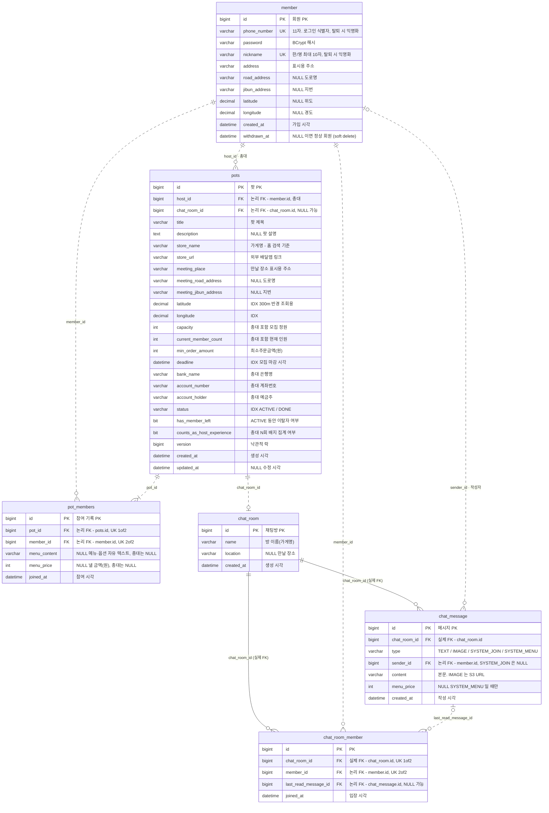

# Delipot 스키마 ERD

`backend/src/main/java/com/delipot` 의 엔티티 6개를 옮긴 DDL 스냅샷.
MySQL 8.4 / InnoDB / utf8mb4, 스키마는 `ddl-auto: update` 로 생성된다.

| | |
|---|---|
| 테이블 | 6 |
| 관계 | 9 |
| 실제 FK 제약 | 2 (둘 다 `chat_room` 을 향한다) |
| 논리적 FK | 7 (plain 컬럼, 앱이 정합성 보장) |

> README 요약본은 [../README.md](../README.md#erd) 참고. 이 문서는 컬럼 단위 상세다.

---

## 관계도

> 실선(`--`)은 DB 에 실제로 걸린 외래키, 점선(`..`)은 컬럼만 있고 제약이 없는 논리적 관계다.
> 엔티티 박스의 `FK` 배지도 같은 구분을 코멘트에 적어뒀다.

---

## 까마귀발 표기 읽는 법

| 기호 | 뜻 | mermaid |
|---|---|---|
| `┃` (바) | 정확히 1 — 필수, 단일 | `\|\|` |
| `○┃` (원+바) | 0 또는 1 — nullable 참조 | `\|o` / `o\|` |
| `○<` (원+까마귀발) | 0 이상 N — 없을 수도 있음 | `}o` / `o{` |
| `┃<` (바+까마귀발) | 1 이상 N — 최소 한 행 보장 | `}\|` / `\|{` |
| 실선 | 실제 FK 제약 (DB 가 보장) | `--` |
| 점선 | 논리적 관계 (앱이 보장) | `..` |

---

## 관계 9개

| 관계 | 카디널리티 | 연결 컬럼 | 제약 | 읽는 법 |
|---|---|---|---|---|
| member → pots | 1 : 0..N | `pots.host_id` | 논리 | 회원 한 명이 팟을 여러 개 연다. 팟에는 총대가 반드시 한 명. |
| member → pot_members | 1 : 0..N | `pot_members.member_id` | 논리 | 회원은 여러 팟에 참여. 같은 팟엔 `UNIQUE(pot_id, member_id)` 로 한 번만. |
| pots → pot_members | 1 : 1..N | `pot_members.pot_id` | 논리 | 총대도 참여 기록 1행으로 들어가므로 최소 한 행. |
| pots → chat_room | 1 : 0..1 | `pots.chat_room_id` | 논리 | 팟 하나에 방 하나. 저장 직후 1회만 세팅, 팟이 `DONE` 이어도 방은 남는다. |
| chat_room → chat_room_member | 1 : 0..N | `chat_room_member.chat_room_id` | **실제 FK** | 방 참여자 목록. `@ManyToOne` 이라 DB 제약이 걸린다. |
| member → chat_room_member | 1 : 0..N | `chat_room_member.member_id` | 논리 | 한 회원이 여러 방에. 방 안에선 `UNIQUE(chat_room_id, member_id)`. |
| chat_room → chat_message | 1 : 0..N | `chat_message.chat_room_id` | **실제 FK** | 방의 메시지 전부. 역시 `@ManyToOne`. |
| member → chat_message | 0..1 : 0..N | `chat_message.sender_id` | 논리 | 작성자. `SYSTEM_JOIN` 은 보낸 사람이 없어 `null`. |
| chat_message → chat_room_member | 0..1 : 0..N | `chat_room_member.last_read_message_id` | 논리 | 읽음 커서. 아직 안 읽었으면 `null`, 한 번 오른 값은 후퇴하지 않는다. |

---

## 테이블 상세

### member — 회원

| 컬럼 | 타입 | NULL | 키 | 설명 |
|---|---|---|---|---|
| `id` | BIGINT AI | NOT NULL | PK | 회원 PK |
| `phone_number` | VARCHAR(11) | NOT NULL | UK | 로그인 식별자. 탈퇴 시 `DEL{id}` 로 익명화 |
| `password` | VARCHAR(255) | NOT NULL | | BCrypt 해시 |
| `nickname` | VARCHAR(10) | NOT NULL | UK | 한/영 최대 10자. 탈퇴 시 `탈퇴{id}` |
| `address` | VARCHAR(255) | NOT NULL | | 표시용 주소 |
| `road_address` | VARCHAR(200) | NULL | | 도로명 주소 |
| `jibun_address` | VARCHAR(200) | NULL | | 지번 주소 |
| `latitude` | DECIMAL(10,7) | NULL | | 위도 |
| `longitude` | DECIMAL(10,7) | NULL | | 경도 |
| `created_at` | DATETIME(6) | NOT NULL | | 가입 시각 |
| `withdrawn_at` | DATETIME(6) | NULL | | soft delete. `null` 이면 정상 회원 |

### pots — 배달팟

`host_id`, `chat_room_id` 는 FK 없는 plain 컬럼이다.

| 컬럼 | 타입 | NULL | 키 | 설명 |
|---|---|---|---|---|
| `id` | BIGINT AI | NOT NULL | PK | 팟 PK |
| `host_id` | BIGINT | NOT NULL | 논리 FK | 총대(작성자) `member.id` |
| `chat_room_id` | BIGINT | NULL | 논리 FK | 연결된 `chat_room.id`. 저장 직후 1회만 세팅 |
| `title` | VARCHAR(100) | NOT NULL | | 팟 제목 |
| `description` | TEXT | NULL | | 팟 설명 |
| `store_name` | VARCHAR(100) | NOT NULL | | 가게명 — 홈 검색 기준 |
| `store_url` | VARCHAR(500) | NOT NULL | | 외부 배달앱 링크 |
| `meeting_place` | VARCHAR(200) | NOT NULL | | 만날 장소 표시용 주소 |
| `meeting_road_address` | VARCHAR(200) | NULL | | 만날 장소 도로명 |
| `meeting_jibun_address` | VARCHAR(200) | NULL | | 만날 장소 지번 |
| `latitude` | DECIMAL(10,7) | NOT NULL | IDX | 300m 반경 조회용 위도 |
| `longitude` | DECIMAL(10,7) | NOT NULL | IDX | 경도 |
| `capacity` | INT | NOT NULL | | 총대 포함 모집 정원 |
| `current_member_count` | INT | NOT NULL | | 총대 포함 현재 참여 인원 |
| `min_order_amount` | INT | NOT NULL | | 최소주문금액(원) |
| `deadline` | DATETIME(6) | NOT NULL | IDX | 모집 마감 시각 |
| `bank_name` | VARCHAR(30) | NOT NULL | | 총대 은행명 |
| `account_number` | VARCHAR(30) | NOT NULL | | 총대 계좌번호 |
| `account_holder` | VARCHAR(30) | NOT NULL | | 총대 예금주 |
| `status` | VARCHAR(20) | NOT NULL | IDX | `ACTIVE` 살아있음 / `DONE` 나눔 완료 |
| `has_member_left` | BIT(1) | NOT NULL | | `ACTIVE` 동안 이탈자가 있었는지 |
| `counts_as_host_experience` | BIT(1) | NOT NULL | | 총대 N회 배지에 셀지 여부(완료 시 확정) |
| `version` | BIGINT | NULL | | 낙관적 락 — 동시 참여 정원 초과 방지 |
| `created_at` | DATETIME(6) | NOT NULL | | 생성 시각 |
| `updated_at` | DATETIME(6) | NULL | | 수정 시각 |

인덱스: `idx_pots_lat_lng (latitude, longitude)`, `idx_pots_status_deadline (status, deadline)`

### pot_members — 팟 참여 기록

총대도 1행으로 들어간다. `UNIQUE(pot_id, member_id)`

| 컬럼 | 타입 | NULL | 키 | 설명 |
|---|---|---|---|---|
| `id` | BIGINT AI | NOT NULL | PK | 참여 기록 PK |
| `pot_id` | BIGINT | NOT NULL | 논리 FK, UK | `pots.id` |
| `member_id` | BIGINT | NOT NULL | 논리 FK, UK | `member.id` — 단독 인덱스도 있음 |
| `menu_content` | VARCHAR(500) | NULL | | 주문 메뉴·옵션 자유 텍스트. 총대는 `null` |
| `menu_price` | INT | NULL | | 참여자가 낼 금액(원). 총대는 `null` |
| `joined_at` | DATETIME(6) | NOT NULL | | 참여 시각 |

### chat_room — 채팅방

팟 1개당 방 1개. 팟이 `DONE` 이 되어도 방은 남는다.

| 컬럼 | 타입 | NULL | 키 | 설명 |
|---|---|---|---|---|
| `id` | BIGINT AI | NOT NULL | PK | 채팅방 PK |
| `name` | VARCHAR(255) | NOT NULL | | 방 이름(가게명) |
| `location` | VARCHAR(200) | NULL | | 만날 장소 |
| `created_at` | DATETIME(6) | NOT NULL | | 생성 시각 |

### chat_room_member — 채팅방 참여자

`UNIQUE(chat_room_id, member_id)`

| 컬럼 | 타입 | NULL | 키 | 설명 |
|---|---|---|---|---|
| `id` | BIGINT AI | NOT NULL | PK | PK |
| `chat_room_id` | BIGINT | NOT NULL | **FK**, UK | `chat_room.id` — 실제 제약 |
| `member_id` | BIGINT | NOT NULL | 논리 FK, UK | `member.id` |
| `last_read_message_id` | BIGINT | NULL | 논리 FK | 마지막으로 읽은 `chat_message.id` (후퇴하지 않음) |
| `joined_at` | DATETIME(6) | NOT NULL | | 입장 시각 |

### chat_message — 채팅 메시지

| 컬럼 | 타입 | NULL | 키 | 설명 |
|---|---|---|---|---|
| `id` | BIGINT AI | NOT NULL | PK | 메시지 PK |
| `chat_room_id` | BIGINT | NOT NULL | **FK** | `chat_room.id` — 실제 제약 |
| `type` | VARCHAR(20) | NOT NULL | | `TEXT` / `IMAGE` / `SYSTEM_JOIN` / `SYSTEM_MENU` |
| `sender_id` | BIGINT | NULL | 논리 FK | `member.id`. `SYSTEM_JOIN` 은 `null` |
| `content` | VARCHAR(2000) | NOT NULL | | 본문. `IMAGE` 는 S3 URL, `SYSTEM_MENU` 는 메뉴 텍스트 |
| `menu_price` | INT | NULL | | `SYSTEM_MENU` 일 때만. 방별 메뉴 합계 계산용 |
| `created_at` | DATETIME(6) | NOT NULL | | 작성 시각 |

---

## 읽을 때 주의할 것

- **FK 가 거의 없다.** 실제 외래키는 `chat_room` 을 향한 둘뿐이다. 나머지는 엔티티에서 `@ManyToOne` 없이 `Long` 컬럼으로만 들고 있어 DB 가 정합성을 지켜주지 않는다 — 삭제·이탈 처리는 서비스 코드 책임.
- **스키마는 `ddl-auto: update` 로 만들어진다.** 이 문서와 DDL 은 스냅샷이지 마이그레이션 소스가 아니다. 엔티티가 바뀌면 같이 갱신한다. 스키마가 안정되면 `validate` + 선적용(또는 Flyway)으로 전환.
- **탈퇴는 지우지 않는다.** `member.withdrawn_at` 만 채우고 `phone_number` / `nickname` 을 익명값으로 덮는다. 남은 팟·메시지의 `member_id` 는 그대로 유효하다.
- **정원 경합은 `pots.version` 이 막는다.** 동시 참여로 `current_member_count` 가 `capacity` 를 넘지 않도록 낙관적 락을 건다.
